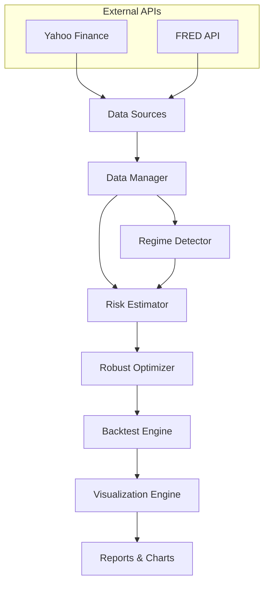

# Design Document

## Overview

The Robust Portfolio Optimization System is designed as a modular Python-based quantitative finance platform that combines regime detection, risk modeling, and robust optimization techniques. The system follows a pipeline architecture where data flows through distinct processing stages: data acquisition → regime detection → risk estimation → optimization → backtesting → visualization.

The design emphasizes modularity, extensibility, and computational efficiency while maintaining the mathematical rigor required for institutional-quality portfolio management.

## Architecture

### High-Level Architecture



### Component Architecture

The system is organized into six core components, each with clearly defined responsibilities:

1. **Data Manager**: Handles all external data acquisition, preprocessing, and storage
2. **Regime Detector**: Implements clustering algorithms for market regime identification
3. **Risk Estimator**: Computes regime-specific statistical parameters
4. **Robust Optimizer**: Solves optimization problems using convex optimization techniques
5. **Backtest Engine**: Simulates portfolio performance and calculates metrics
6. **Visualization Engine**: Generates charts, plots, and analytical reports

## Components and Interfaces

### Data Manager

**Purpose**: Centralized data acquisition and preprocessing hub

**Key Classes**:
- `DataDownloader`: Interfaces with Yahoo Finance and FRED APIs
- `DataProcessor`: Handles return calculations, feature engineering, and standardization
- `DataValidator`: Ensures data quality and handles missing values

**Interfaces**:
```python
class DataManager:
    def download_asset_data(self, tickers: List[str], start_date: str, end_date: str) -> pd.DataFrame
    def download_macro_data(self, series_ids: List[str], start_date: str, end_date: str) -> pd.DataFrame
    def compute_returns(self, prices: pd.DataFrame) -> pd.DataFrame
    def create_regime_features(self, returns: pd.DataFrame, macro_data: pd.DataFrame) -> pd.DataFrame
    def validate_data(self, data: pd.DataFrame) -> bool
```

**Data Sources**:
- **Asset Data**: ETF tickers (SPY, AGG, GLD, XLE, etc.) via yfinance
- **Macro Data**: VIX, yield spreads, economic indicators via FRED API
- **Features**: Rolling volatility (20-day), market returns, VIX levels, yield curve slope

### Regime Detector

**Purpose**: Identify distinct market regimes using unsupervised learning

**Key Classes**:
- `RegimeClusterer`: Implements K-means and HMM-based clustering
- `FeatureEngineer`: Creates regime-detection features
- `RegimeValidator`: Validates regime stability and economic interpretation

**Interfaces**:
```python
class RegimeDetector:
    def fit_regimes(self, features: pd.DataFrame, n_regimes: int = 3) -> np.ndarray
    def predict_regime(self, features: pd.DataFrame) -> int
    def get_regime_statistics(self) -> Dict[int, Dict[str, float]]
    def validate_regimes(self, regime_labels: np.ndarray) -> bool
```

**Algorithm Selection**:
- **Primary**: K-means clustering on standardized features
- **Alternative**: Hidden Markov Models for temporal dependencies
- **Features**: Rolling volatility, returns, VIX, macro indicators
- **Validation**: Silhouette analysis and economic interpretation

### Risk Estimator

**Purpose**: Compute regime-specific risk and return parameters

**Key Classes**:
- `CovarianceEstimator`: Implements sample and shrinkage covariance estimation
- `ReturnEstimator`: Calculates regime-specific expected returns
- `RiskValidator`: Ensures positive semi-definite covariance matrices

**Interfaces**:
```python
class RiskEstimator:
    def estimate_regime_covariance(self, returns: pd.DataFrame, regime_labels: np.ndarray) -> Dict[int, np.ndarray]
    def estimate_regime_returns(self, returns: pd.DataFrame, regime_labels: np.ndarray) -> Dict[int, np.ndarray]
    def apply_shrinkage(self, sample_cov: np.ndarray, shrinkage_target: str = 'identity') -> np.ndarray
    def validate_covariance(self, cov_matrix: np.ndarray) -> bool
```

**Estimation Methods**:
- **Sample Covariance**: Direct calculation from regime-specific returns
- **Shrinkage Estimation**: Ledoit-Wolf shrinkage for small sample sizes
- **Regularization**: Ridge regularization for numerical stability
- **Validation**: Eigenvalue decomposition for positive semi-definiteness

### Robust Optimizer

**Purpose**: Solve robust optimization problems across market regimes

**Key Classes**:
- `WorstCaseOptimizer`: Implements worst-case variance minimization
- `CVaROptimizer`: Implements Conditional Value at Risk optimization
- `ConstraintManager`: Handles portfolio constraints and bounds

**Interfaces**:
```python
class RobustOptimizer:
    def optimize_worst_case(self, regime_covariances: Dict[int, np.ndarray], constraints: Dict) -> np.ndarray
    def optimize_cvar(self, regime_returns: Dict[int, np.ndarray], regime_probs: np.ndarray, alpha: float) -> np.ndarray
    def add_constraint(self, constraint_type: str, parameters: Dict) -> None
    def solve_optimization(self) -> OptimizationResult
```

**Optimization Formulations**:

1. **Worst-Case Variance Minimization**:
   ```
   minimize: t
   subject to: w^T * Σ_r * w ≤ t  for all regimes r
              sum(w) = 1
              w ≥ 0
              w_i ≤ w_max
   ```

2. **Regime-Weighted CVaR**:
   ```
   minimize: VaR + (1/α) * E[max(0, -R - VaR)]
   subject to: portfolio constraints
   ```

**Solver Integration**:
- **Primary**: CVXPY for convex optimization problems
- **Alternative**: PULP for mixed-integer variants
- **Solver Backend**: MOSEK, GUROBI, or ECOS depending on availability

### Backtest Engine

**Purpose**: Simulate out-of-sample portfolio performance

**Key Classes**:
- `BacktestSimulator`: Orchestrates rolling window backtests
- `PerformanceCalculator`: Computes risk-adjusted performance metrics
- `BenchmarkComparator`: Compares against standard benchmarks

**Interfaces**:
```python
class BacktestEngine:
    def run_backtest(self, start_date: str, end_date: str, rebalance_freq: str) -> BacktestResult
    def calculate_performance_metrics(self, returns: pd.Series) -> Dict[str, float]
    def compare_strategies(self, strategy_returns: Dict[str, pd.Series]) -> pd.DataFrame
    def account_for_transaction_costs(self, weights: pd.DataFrame, cost_bps: float) -> pd.Series
```

**Backtesting Framework**:
- **Rolling Windows**: 252-day estimation windows with monthly rebalancing
- **Out-of-Sample**: Strict temporal separation between estimation and testing
- **Transaction Costs**: Proportional costs based on portfolio turnover
- **Benchmarks**: Equal-weight, Markowitz mean-variance, and market cap-weighted

### Visualization Engine

**Purpose**: Generate comprehensive charts and analytical reports

**Key Classes**:
- `RegimePlotter`: Creates regime detection and transition visualizations
- `AllocationVisualizer`: Generates portfolio allocation heatmaps and charts
- `PerformanceAnalyzer`: Creates performance comparison and attribution plots

**Interfaces**:
```python
class VisualizationEngine:
    def plot_regime_detection(self, regime_labels: np.ndarray, dates: pd.DatetimeIndex) -> plt.Figure
    def create_allocation_heatmap(self, weights: pd.DataFrame) -> plt.Figure
    def plot_performance_comparison(self, strategy_returns: Dict[str, pd.Series]) -> plt.Figure
    def generate_summary_report(self, backtest_results: Dict) -> str
```

## Data Models

### Core Data Structures

```python
@dataclass
class RegimeParameters:
    regime_id: int
    mean_returns: np.ndarray
    covariance_matrix: np.ndarray
    regime_probability: float
    start_date: pd.Timestamp
    end_date: pd.Timestamp

@dataclass
class OptimizationResult:
    weights: np.ndarray
    objective_value: float
    solver_status: str
    computation_time: float
    constraints_satisfied: bool

@dataclass
class BacktestResult:
    portfolio_returns: pd.Series
    portfolio_weights: pd.DataFrame
    performance_metrics: Dict[str, float]
    benchmark_comparison: pd.DataFrame
    regime_attribution: pd.DataFrame
```

### Database Schema

The system uses a lightweight SQLite database for caching and persistence:

```sql
-- Asset price data
CREATE TABLE asset_prices (
    date DATE,
    ticker VARCHAR(10),
    price DECIMAL(10,4),
    PRIMARY KEY (date, ticker)
);

-- Regime classifications
CREATE TABLE regime_labels (
    date DATE PRIMARY KEY,
    regime_id INTEGER,
    regime_probability DECIMAL(5,4)
);

-- Portfolio weights
CREATE TABLE portfolio_weights (
    date DATE,
    ticker VARCHAR(10),
    weight DECIMAL(8,6),
    strategy VARCHAR(50),
    PRIMARY KEY (date, ticker, strategy)
);
```

## Error Handling

### Data Quality Issues
- **Missing Data**: Forward-fill for short gaps, interpolation for longer periods
- **Outliers**: Winsorization at 1st and 99th percentiles
- **API Failures**: Retry logic with exponential backoff, fallback to cached data

### Numerical Stability
- **Singular Matrices**: Regularization and shrinkage estimation
- **Optimization Failures**: Fallback to simpler formulations
- **Convergence Issues**: Multiple solver attempts with different parameters

### Runtime Errors
- **Memory Management**: Chunked processing for large datasets
- **Computation Timeouts**: Configurable time limits with graceful degradation
- **Validation Failures**: Comprehensive input validation with informative error messages

## Testing Strategy

### Unit Testing
- **Data Processing**: Test return calculations, feature engineering, and validation
- **Regime Detection**: Test clustering algorithms with synthetic data
- **Optimization**: Test solver integration with known optimal solutions
- **Performance Metrics**: Test calculation accuracy against manual computations

### Integration Testing
- **End-to-End Pipeline**: Test complete workflow with historical data
- **API Integration**: Test data download and processing with live APIs
- **Cross-Component**: Test data flow between components

### Performance Testing
- **Scalability**: Test with varying numbers of assets and time periods
- **Memory Usage**: Profile memory consumption with large datasets
- **Computation Time**: Benchmark optimization solver performance

### Validation Testing
- **Financial Accuracy**: Compare results against academic literature
- **Regime Stability**: Test regime detection consistency across different periods
- **Optimization Verification**: Verify constraint satisfaction and optimality conditions

## Implementation Notes

### Technology Stack
- **Core**: Python 3.9+, NumPy, Pandas, SciPy
- **Optimization**: CVXPY, PULP
- **Machine Learning**: Scikit-learn, hmmlearn
- **Data APIs**: yfinance, fredapi
- **Visualization**: Matplotlib, Seaborn, Plotly
- **Database**: SQLite for caching, optional PostgreSQL for production

### Performance Considerations
- **Vectorization**: Use NumPy operations for matrix computations
- **Caching**: Cache expensive computations (covariance estimation, optimization results)
- **Parallel Processing**: Use multiprocessing for independent regime calculations
- **Memory Optimization**: Use appropriate data types and chunked processing

### Extensibility
- **Plugin Architecture**: Support for additional optimization objectives
- **Custom Regimes**: Interface for user-defined regime detection methods
- **Alternative Data**: Framework for incorporating alternative data sources
- **Risk Models**: Support for factor models and alternative risk measures